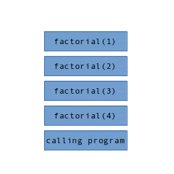
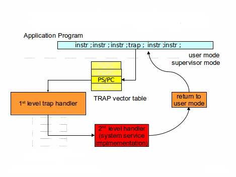
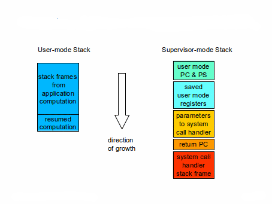

Stack Frames and Linkage Conventions

Stack Frames and Linkage Conventions
====================================

Introduction
------------

Two fundamental questions that quickly arise in the implementation of an operating system are:

1.  what constitutes the state of a computation, and how can that state be saved and restored?
2.  what are the mechanisms by which one software component can request services, and receive results from another?

We can begin the exploration of these questions by examining subroutine linkage conventions. Most students will have already been exposed to this in previous courses (e.g. computer architecture, programming languages, compiler construction); This brief review is intended to refresh your understanding of the basic concepts so that we can build upon them.

The Stack Model of Programming Languages
----------------------------------------

Most modern programming languages support procedure-local variables:

*   They are automatically allocated whenever the procedure (or block) is entered.
*   They are only visible to code within that procedure (or block). They cannot be seen or accessed by code in calling or called procedures.
*   Each distinct (e.g. recursive or parallel) invocation of the procedure (or block) has its own distinct set of local variables.
*   They are automatically deallocated when the procedure (or block) exits/returns.

These local variables, as well as parameters and intermediate computational results are most commonly stored in a Last-In-First-Out stack: with new call frames being pushed onto the stack whenever a procedure is called (or a block entered) and old frames being popped off the stack whenever a procedure returns (or a block is exited). Consider the recursive factorial implementation:

	int factorial( int value ) {
		if (value <= 1)
			return(value);
		else
			return(value \* factorial(value - 1));
	}

If I call factorial(4), just before the final invocation of factorial returns, there would be four instances of factorial on the stack, in addition to the call frames for the code that called factorial in the first place.

The stack model for procedure calls is so universal that most processor architectures provide hardware instructions for stack management, and depend on the presence of a stack to make subroutine calls or handle exceptions. It should be remembered, however, that the stack model does not work for all memory allocation needs. Many data items must last longer than the procedure that created them. For example, when read a document into memory, I do not expect that document to disappear as soon as the read function returns. Long lived resources should not be allocated on the stack, but rather from the _heap_ (which we will discuss in a few weeks).

Subroutine Linkage Conventions
------------------------------

The details of subroutine linkage conventions are highly Instruction Set Architecture specific, and in some cases language-specific. The following examples will be based on the Intel x86 architecture. The instructions and registers will be very different for other ISAs, but the basic concepts will remain valid.

The basic elements of subroutine linkage are:

*   parameter passing ... marshaling the information that will be passed as parameters to the called routine.
*   subroutine call ... save the return address (in the calling routine) on the stack, and transfer control to the entry point (of the called routine).
*   register saving ... saving the contents of registers that the linkage conventions declare to be _non-volatile_, so that they can be restored when the called routine returns.
*   allocating space for the local variables (and perhaps computational temporaries) in the called routine.

When the called routine completes, the process of returning is fairly symmetric:

*   return value ... placing the return value in the place where the calling routine expects to find it.
*   popping the local storage (for the called routine) off the stack.
*   register restoring ... restore the non-volatile registers to the values they had when the called routine was entered.
*   subroutine return ... transfer control to the return address that the calling routine saved at the beginning of the call.

The corresponding x86 code (for the above factorial example illustrates the register conventions and respective responsibilities of the caller and callee. The code in green is executed by _callees_. The code in red is executed by _callers_.

factorial:

	subq	$8, %rsp	// 4-byte local, 16-byte frame alignment

	movl	%edi, 4(%rsp)	// keep local copy of value
	cmpl	$1, %edi	// compare value with one
	jg	.L2		// if greater, recurse
	movl	4(%rsp), %eax	// recursion has ended, result is parameter
	jmp	.L3		// and return

   .L2:	movl	4(%rsp), %eax	// recover value
   	subl	$1, %eax	// value - 1

	movl	%eax, %edi	// value-1 as new parameter
	call	factorial

	imul	4(%rsp), %eax	// multiply result by value

   .L3:
   	addq	$8, %rsp	// restore stack to value at entry
	ret

X86 Register Conventions:

*   %rsp is the hardware-defined stack pointer.
*   the X86 stack grows downwards:  
    A push operation causes the top of stack to be the next lower address.  
    A Pop operation causes the top of stack to be the next higher address.
*   %eax/%rax is a volatile register that is expected to contain the return value when the called routine returns.
*   the first six parameters are passed in registers, the first being passed in %rdi (or in this case %edi)
*   the call instruction pushes the address of the next instruction onto the stack, and then transfers control to the next location.
*   the ret instruction pops the return address off of the top of the stack and transfers back to that location.

While these details can be ISA specific, we also observe that:

*   If the called routine needs to use any non-volatile registers it must save them. This is done because only the called routine knows which registers it will use (and therefore which it needs to save and restore).
*   Cleaning callee-allocated locals (and saved registers) off the stack is the callee's responsibility. It knows what it allocated, so it must deallocate them, returning the stack to its state at entry.
*   Cleaning (stack-passed) parameters off of the stack is the responsibility of the calling routines. This is often done, because only the calling routine knows how many parameters is actually passed.
*   The clear delineation of responsibilities between the caller and callee make it possible to have procedures written in one language (e.g. C) called by programs written in another language (e.g. FORTRAN).

Even though the details may be different in other Instruction Set Architectures there is value in understanding each step of the above process, because the same basic steps (some, perhaps automated by hardware) can be seen in almost all linkage conventions. After you have understood one set of linkage conventions, you should have little trouble understanding others.

It is also interesting to note how relatively simple it is to save and restore the state of a procedure; It is merely a stack frame and a few registers ... most of whose values are stored in the next stack frame.

Traps and Interrupts
--------------------

Most Instruction Set Architectures include support for interrupts (to inform the software than an external event has happened) and traps (to inform the software of an execution fault). These are similar to procedure calls in that:

*   we want to transfer control to an interrupt or trap handler.
*   we need to save the state of the running computation before doing so.
*   after the event has been handled, we want to restore the saved state and resume the interrupted computation.

The key differences between a procedure call and an interrupt/trap are:

*   a procedure call is requested by the running software, and the calling software expects that, upon return, some function will have been performed, and an appropriate value returned.
*   because a procedure call is initiated by software, all of the linkage conventions are under software control. Because interrupts and traps are initiated by the hardware, the linkage conventions are strictly defined by the hardware.
*   the running software was not expecting a trap or interrupt, and after the event is handled, the computer state should be restored as if the trap/interrupt had never happened.

A typical interrupt or trap mechanism works as follows:

*   there is a number (0, 1, 2 ...) associated with every possible external interrupt or execution exception.
*   there is a table, initialized by the OS software, that associates a Program Counter and Processor Status word (PC/PS pair) with each possible external interrupt or execution exception.
*   when an event happens that would trigger an interrupt or trap:
    1.  the CPU uses the associated interrupt/trap number to index into the appropriate interrupt/trap vector table.
    2.  the CPU loads a new program counter and processor status word from the appropriate interrupt/trap vector.
    3.  the CPU pushes the program counter and processor status word associated with the interrupted computation onto the CPU stack (associated with the new processor status word).
    4.  execution continues at the address specified by the new program counter.
    5.  the selected code (usually written in assembler, and called a _first level handler_:
        *   saves all of the general registers on the stack
        *   gathers information from the hardware on the cause of the interrupt/trap
        *   chooses the appropriate second level handler
        *   makes a normal procedure call to the second level handler, which actually deals with the interrupt or exception.
*   after the second level handler has dealt with the event, it returns to the first level handler, after which ...
    1.  the 1st level handler restores all of the saved registers (from the interrupted computation).
    2.  the 1st level handler executes a privileged return from interrupt or return from trap instruction.
    3.  the CPU re-loads the program counter and processor status word from the values saved at the time of interrupt/trap.
    4.  execution resumes at the point of interruption.

  
**Flow-of-control associated with a (system call) trap**

  
**Stacking and un-stacking of a (system call) trap**

This interrupt/trap mechanism:

*   does a more complete job of saving and restoring the state of the interrupted computation.
*   translates the (much simpler) hardware-driven call to the 1st level handler into a normal higher-level-language procedure call to the chosen 2nd level hander.

The similarities might make it seem that an interrupt/trap is only a little bit more expensive than a procedure call (more registers to save, plus the added computation to decide what 2nd level handler to call. But this ignores the fact that an interrupt/trap causes a new processor status word to be loaded into the CPU ... which will probably move us to a new (likely more privileged) processor mode, running in a new (unrelated to the interrupted program) address space, and almost surely involve a complete loss of the CPU caches. And the same things will happen again upon return. Consequently, taking an interrupt or trap is likely to be somewhere between 100x and 1000x as expensive as making a procedure call.

Summary
-------

Procedure and trap/interrupt linkage instructions provide us with:

*   a preliminary low level definition of _the state of a computation_ and what it means to _save_ and _restore_ that state.
*   an introduction to the basic CPU-supported mechanisms for synchronous and and asynchronous transfers of control.
*   an initial example of how it might be possible to interrupt an on-going computation, do other things, and then return to the interrupted computation as if it had never been interrupted.

In the following chapters we will build on these foundations to implement processes and system calls.