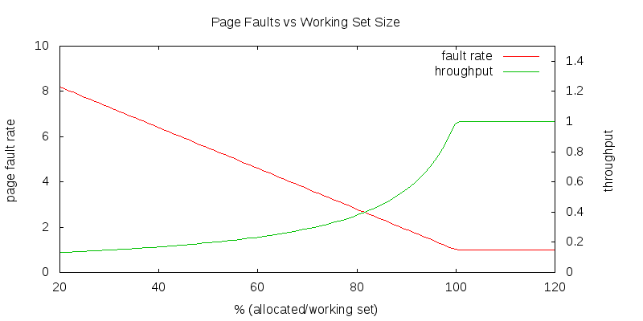

Working Sets
============

**Annual income twenty pounds, annual expenditure nineteen** \[pounds\], **nineteen** \[shillings\] **and six** \[pence\] **... result happiness.  
Annual income twenty pounds, annual expenditure twenty pounds ought and six ... result misery.**

_Wilkins Micawber (Charles Dickens)_

LRU is not enough
-----------------

The success of LRU (Least Recently Used) replacement algorithms is the stuff of legends. Nobody knows what tomorrow will bring, but for most purposes our best guess is that the near future will be like the recent past. Unless you have inside information (i.e. references are not random, and you know understand the pattern) it is generally held that there is little profit to be gained from trying to out-smart LRU. The reason LRU works so well is that most programs exhibit some degree of temporal and spatial locality:

*   if they use some code or data, they are likely to come back to access the same locations again.
*   If they access code or data in a particular page, they are likely to reference other code (or data) in the same vicinity.

But these are statements about a single program or process. If we are doing Round-Robin time-sharing with multiple processes we give each process a brief opportunity to run, after which we run all the other processes before running it again. With the exception of shared text segments, separate processes seldom access the same pages.

*   the most recently used pages in memory belong to the process that will not be run for a long time.
*   the least recently used pages in memory belong to the process that is just about to run again.
*   this destroys strict temporal and spatial locality, as reference behavior becomes periodic (rather than continuous).

In the absence of temporal and spatial locality, Global LRU will make poor decisions. Global LRU and Round-Robin scheduling are great algorithms, but they do not work well as a team. It might make sense to give each process its own dedicated set of page frames. When that process needed a new page, we would let LRU replace the oldest page in that set. This would be _per-process_ LRU, and that might work very well with Round-Robin scheduling.

The concept of a Working Set
----------------------------

As we discovered in our discussion of paging:

*   We do not need to give each process as many pages of physical memory as appear in the virtual address space.
*   We do not even need to give each process as many pages of its virtual address as it will ever access.

It is a good thing if a process experiences occasional page faults, and has to replace old (no longer interesting) pages with new ones. What we want to avoid is page faults due to running a process in too little memory. We want to keep the page-faults down to a manageable rate. The ideal mean-time-between-page-faults would be equal to the time-slice length. As we give a process fewer and fewer page frames in which to operate, the page fault rate rises and our performance gets worse (as we spend less time doing useful computation and more time processing page faults).

The dramatic degradation in system performance associated with not having enough memory to efficiently run all of the ready processes is called _thrashing_.

*   If we think that we can have 25 processes in the ready queue, then we had better have enough memory for all 25 of those processes.
*   If we only have enough memory to run 15 of those processes, then we should take the other 10 out of the ready queue (e.g. by swapping them out).
*   The improved performance resulting from reducing the number of page faults will more than make up for the delays processes experience while being swapped between primary and secondary storage.

There is, for any given computation, at any given time, a number of pages such that:

*   if we increase the number of page frames allocated to that process, it makes very little difference in the performance.
*   if we reduce the number of page frames allocated to that process, the performance suffers noticeably.

We will call that number the process' _working set size_ (at that particular time).

How large is a working set
--------------------------

Different computations require different amounts of memory. A tight loop operating on a few variables might need only two pages. Complex combinations of functions applied to large amounts of data could require hundreds of thousands of pages. Not only are different programs likely to require different amounts of memory, a single program may require different amounts of memory at different points during its execution.

Requiring more memory is not necessarily a bad thing ... it merely reflects the costs of that particular computation. When we explored scheduling we saw that different processes have different degrees of interactivity, and that if we could characterize the interactivity of each process we could more efficiently schedule it. The same is true of working set size. We can infer a process' working set size by observing its behavior. If a process is experiencing many page faults, its working set is larger than the memory currently allocated to it. If a process is not experiencing page faults, it may have too much memory allocated to it. If we can allocate the right amount of memory to each process, we will minimize our page faults (overhead) and maximize our throughput (efficiency).

Implementing Working Set replacement
------------------------------------

Regularly scanning all of memory to identify the least recently used page is a very expensive process. With Global LRU, we saw that a clock-like scan was a very inexpensive way to achieve a very similar affect. The clock hand position was a surrogate for age:

*   the most recently examined pages are immediately behind the hand.
*   the pages we examined longest ago are immediately in front of the hand.
*   if the page immediately in front of the hand has not be referenced since the last time it has been scanned, it must be very old ... even if it is not actually the oldest page in memory.

We can use a very similar approach to implement working sets. But we will need to maintain a little bit more information:

*   each page frame is associated with an _owning process_
*   each process has an _accumulated CPU time_
*   each page frame will have a _last referenced_ time, value, taken from the _accumulated CPU_ timer of its _owning process_.
*   we maintain a _target age_ parameter ... which is _keep in memory_ goal for all pages.

The new scan algorithm will be:

    
    	while ...
    	{
    		// see if this page is old enough to replace
    		owningProc = page->owner;
    		if (page->referenced) {
    			// assume it was just referenced
    			page->lastRef = owningProc->accumulatedTime;
    			page->referenced = 0;
    		} else {
    			// has it gone unreferenced long enough?
    			age = owningProc->accumulatedTime - page->lastRef;
    			if (age > targetAge)
    				return(page);
    		}
    	}
    

The key elements of this algorithm are:

*   Age decisions are not made on the basis of clock time, but accumulated CPU time in the owning process. Pages only age when their owner runs without referencing them.
*   If we find a page that has been referenced since the last scan, we assume it was just referenced.
*   If a page is younger than the target age, we do not want to replace it ... since recycling of young pages indicates we may be thrashing.
*   If a page is older than the target age, we take it away from its current owner, and give it to a new (needy) process.

If there are no pages older than the target age, we apparently have too many processes to fit in the available memory:

*   If we complete a full scan without finding anything that is older than the target age, we can replace the oldest page in memory. This works, but at the cost of the very expensive complete scan that the clock algorithm was supposed to avoid.
*   If we believe that our target age was well chosen (to avoid thrashing) we probably need to reduce the number of processes in memory.

Dynamic Equilibrium to the rescue
---------------------------------

This is often referred to as a _page stealing_ algorithm, because a process that needs another page _steals_ it from a process that does not seem to need it as much.

*   Every process is continuously losing pages that it has not recently referenced.
*   Every process is continuously stealing pages from other processes.
*   Processes that reference more pages more often, will accumulate larger working sets.
*   Processes that reference fewer pages less often will find their working sets reduced.
*   When programs change their behavior, their allocated working sets adjust promptly and automatically.

This is a dynamic equilibrium mechanism. The continuously opposing processes of stealing and being stolen from will automatically allocate the available memory to the running processes in proportion to their working set sizes. It does not try to manage processes to any pre-configured notion of a reasonable working set size. Rather it manages memory to minimize the number of page faults, and to avoid thrashing.